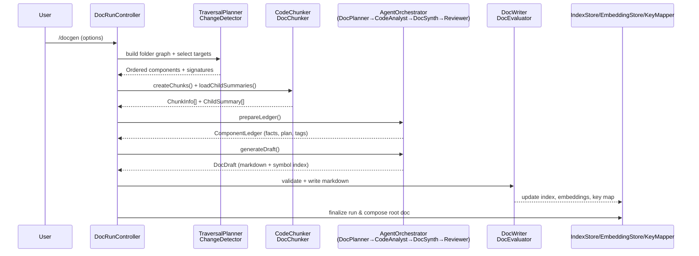

# Documentation Generation Pipeline Architecture

## Overview
The documentation pipeline turns raw code folders into canonical `nicespecs.*.md` files through a deterministic state machine backed by persona-specific prompts. Every run enforces guardrails, chunking rules, and reviewer validation before touching disk.

## Pipeline Diagram

## Stage Breakdown
1. **Guarded Initialization**
   - `DocRunController` ensures workspace availability, loads configuration, and checks `.nicespecs/index.json` for in-progress runs (resume vs restart logic).
   - `CostEstimator` forecasts token usage per component; user approval gates expensive runs.
2. **Traversal & Target Selection**
   - `TraversalPlanner` performs BFS using ignore lists and depth metadata.
   - `ChangeDetector` pairs traversal output with git signatures (`SignatureScanner`) to derive `SelectedComponent[]`, minimizing unnecessary processing.
3. **Chunking & Child Context**
   - `CodeChunker` chunkifies only local files while honoring size caps and semantic boundaries.
   - `DocChunker` loads child docs, extracting `Purpose/Responsibilities/Dependencies/Operational Notes` for relationship summaries.
4. **Persona Reasoning Loop**
   - `AgentOrchestrator.prepareLedger()` runs DocPlanner + CodeAnalyst prompts, assembling facts, tags, and objectives.
   - Persisting run state here ensures crashes never require re-chunking.
5. **Synthesis & Review**
   - `AgentOrchestrator.generateDraft()` invokes DocSynthesizer to transform the ledger into structured JSON, then renders Markdown via `renderDocumentation`.
   - Optional `QualityReviewerAgent` cross-checks the draft; reviewer feedback loops back into synthesis until acceptance.
6. **Persistence**
   - `DocWriter` validates the draft (`DocEvaluator`) and writes markdown.
   - Embedding and key-map stores update atomically; `IndexStore` logs timestamps, token counts, and completion status.
   - `RootComposer` aggregates child docs into `nicespecs.root.md` after all components finish.

## Prompt Design
### DocPlanner (`DocOrchestrator` persona)
- **Intent**: Generate a JSON plan describing objectives, ordered steps tied to file names, and risks/open questions per component.
- **Prompt Traits**:
  - Includes file list + summarized child docs.
  - Enforces `STRICT JSON` with `{ objectives, steps, risks }`.
  - Encourages thinking about sequencing before output (explicit “First think” instruction).
  - Output seeds ledger metadata and helps reviewer trace plan → execution.

### CodeAnalysisAgent (`CodeAnalyst` persona)
- **Intent**: Convert batches of up to four chunks into factual notes.
- **Prompt Traits**:
  - Requires a “tree-of-thought” style analysis: hypotheses (API surface, data flow, dependencies, failure handling) before conclusions.
  - Returns JSON keyed by `chunkId`, each containing `analysis[]`, `summary`, `responsibilities[]`, `dependencies.internal/external`, and `tags[]`.
  - Snippets are trimmed to 1,600 chars to stay within token budget without truncating structural cues.
  - Batch processing ensures consistent tone and token efficiency.

### DocSynthesisAgent (`DocSynthesizer` persona)
- **Intent**: Transform ledger facts + plan + child summaries into the canonical markdown sections.
- **Prompt Traits**:
  - Enforces two internal buffers:
    - `LocalDetail` ensures rich descriptions for files inside the folder.
    - `ChildRelationships` constrains child references to one sentence + hyperlink, preventing scope leaks.
  - Requires JSON output covering summary, purpose, responsibilities, file inventory, code structure synopsis, per-file sections, data flow, dependencies, child components, operational notes, risks, changelog, and tags.
  - Demands inclusion of every local file in `fileInventory` even if no symbols exist (empty array), keeping KeyMapper accurate.
  - Accepts optional reviewer constraints to guide re-synthesis.

### QualityReviewerAgent (`QualityReviewer` persona)
- **Intent**: Gate each doc with a checklist-driven verdict.
- **Prompt Traits**:
  - Receives ledger facts + child summaries for grounding plus the rendered markdown.
  - Must reply either `ACCEPT - <reason>` or `REVISE: <fixes>`, simplifying controller routing.
  - Checklist enforces: evidence grounding, proper child references, correct section order/tone.
  - Rework feedback pipes back into DocSynthesizer’s constraints parameter.

## Resilience & Observability
- Ledger snapshots (facts, plan, child summaries, tags) are saved before synthesis, enabling resume after VS Code restarts or cancellations.
- `throwIfCancelled` checks at every IO-heavy stage keep the UI responsive.
- Controller aggregates actual vs estimated token counts for user-facing summaries.
- Reviewer + evaluator failures never write partial docs; `IndexStore` marks the component as paused until a rerun succeeds.

## Extending the Pipeline
- New personas (e.g., diagram generator) can plug into `AgentOrchestrator` without altering traversal or storage logic.
- Additional section types can be added by extending the DocSynth JSON schema + `renderDocumentation` template; prompts will inherit the new requirements automatically.
- Alternative reviewers (lint rules, compliance checklists) can run after `QualityReviewerAgent` but before persistence to enforce project-specific standards.
