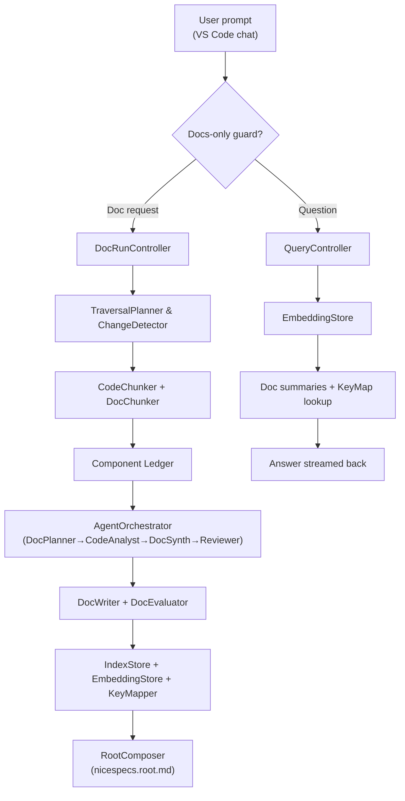

# Nice Specs – High-Level Architecture

## Overview
`@nicespecs` is a VS Code chat extension that keeps engineering teams documentation-first. Every user prompt is routed through two guarded pipelines:
1. **Documentation pipeline** generates or refreshes `nicespecs.*.md` files component-by-component.
2. **Query pipeline** answers questions about already generated docs using embeddings and symbol indices.

Both pipelines share traversal metadata, chunking utilities, persistence layers under `.nicespecs/`, and persona-driven language-model prompts to keep reasoning deterministic.

## Component Map
- **Extension Shell (`extension.ts`)** – registers chat participant, enforces guardrails, dispatches to controllers.
- **Controllers**
  - `DocRunController` orchestrates doc runs (planning, analysis, synthesis, persistence).
  - `QueryController` resolves read-only questions via the embedding store.
- **Traversal & Analysis** – `TraversalPlanner`, `CodeChunker`, `DocChunker`, and `SignatureScanner` derive component graphs plus semantic chunks.
- **Persona Engine** – `AgentOrchestrator` coordinates planner, analyst, synthesizer, and reviewer prompts over VS Code’s chat model API.
- **Persistence**
  - `IndexStore` journals progress, timestamps, and resumes stalled runs.
  - `EmbeddingStore` (SQLite) powers semantic lookup for both doc and query flows.
  - `KeyMapper` indexes symbols → files/chunks for precise references.
- **Writers & Evaluators** – `DocWriter` emits markdown via the canonical template; `DocEvaluator` enforces `documentation-strategy.md`.

## System Flow

## Execution Stages
1. **Guard & Costing** – Non-document prompts are rejected; doc runs estimate token budgets before asking for approval.
2. **Traversal & Selection** – BFS traversal builds `FolderNode` graphs, while `ChangeDetector` filters folders to those affected by recent code deltas.
3. **Chunking & Evidence Capture** – `CodeChunker` slices files into semantic windows with brace-awareness; `DocChunker` loads child doc snippets to preserve hierarchy context.
4. **Persona Reasoning** – Planner→Analyst→Synthesizer→Reviewer prompts collect facts, narrate local behavior, and enforce template conformance without leaking child internals.
5. **Persistence & Resume** – Every folder write updates `.nicespecs/index.json`, embedding vectors, and key-map entries so runs can resume mid-component and query flow stays fresh.
6. **Query Resolution** – Questions hit the embedding index first; relevant docs and symbol metadata are streamed back with citations. Missing docs trigger a `/docgen` recommendation.

## Storage & Contracts
- `.nicespecs/index.json` – run metadata, timestamps, resume pointers, child relationships.
- `.nicespecs/embeddings.sqlite` – deterministic 64-dim vectors per doc for semantic search.
- `.nicespecs/keymap.sqlite` (or JSON fallback) – `{componentId, file, symbol, chunkId}` records for precise references.
- Generated docs live beside the code they describe, ensuring traversal + RAG stay local.

## Resilience & Extensibility
- Deterministic state machine inside `DocRunController` makes interruptions resumable.
- Persona prompts are isolated in `AgentOrchestrator`, so swapping models or prompt text never touches traversal or persistence code.
- New pipelines (e.g., linting, ADR generation) can plug into the same traversal + chunking stack by wiring additional controllers that reuse the ledger format and storage.
