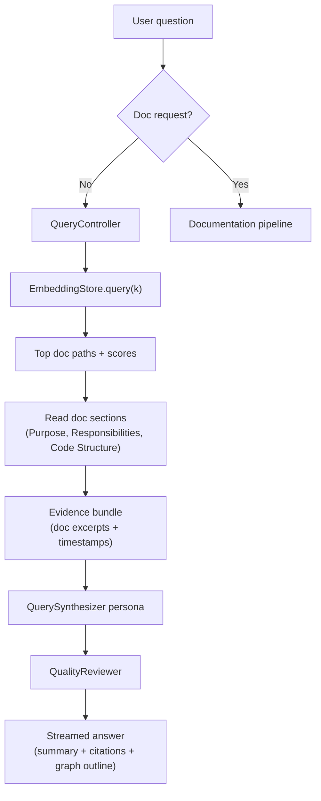

# Query Agent Pipeline Architecture

## Overview
When users ask questions instead of requesting new docs, the extension activates the Query Agent Pipeline. It reuses the same documentation artifacts—embeddings, key maps, and ledger-style evidence—to produce grounded answers with clear citations, without touching the filesystem or language models more than necessary.

## Flow Diagram


## Stage Breakdown
1. **Intent Capture & Guarding**
   - The shared orchestrator guard classifies prompts as “doc generation” vs “query”.
   - Ambiguous prompts trigger a clarification request before continuing.
2. **Evidence Retrieval**
   - `EmbeddingStore.query(prompt, k)` returns up to `k` doc paths (default 3–5) ordered by cosine similarity.
   - For each hit, `QueryController` opens the markdown file, extracts `Purpose`, `Responsibilities`, and `Code Structure` sections (falling back to leading text when absent), and collects timestamps via the embedding metadata.
   - If no docs exist, the pipeline recommends running `/docgen`.
3. **Optional Symbol Expansion**
   - When the user references specific functions/classes, the pipeline queries `KeyMapper` (SQLite or JSON fallback) to attach `{symbol → file → chunkId}` details, ensuring answers include precise locations.
4. **Reasoning & Response**
   - Evidence (doc excerpts, symbol metadata, question keywords) flows into persona prompts that build dependency graphs, run tree-of-thought reasoning, and render citations.
   - Responses follow a standard structure: summary paragraph, key findings with sources, optional dependency outline, and confidence/gaps note.

## Prompt Design
### Intent + Retrieval (`DocOrchestrator` lightweight prompt)
- **Goal**: Normalize the user question, extract keywords (components, APIs, data sources), and confirm the pipeline choice.
- **Prompt Traits**:
  - Emphasizes scope enforcement (documentation-only).
  - Captures synonyms or alternate names for better embedding queries.
  - Emits a short JSON blob (`{ intent, keywords[] }`) reused by retrieval + reasoning.

### Evidence Assembly (`CodeAnalyst` reuse)
- **Goal**: When extra code context is needed (e.g., doc gaps, new files since last run), reuse the same `CodeAnalyst` prompt structure to summarize relevant chunks.
- **Prompt Traits**:
  - Maintains consistent `LedgerFact` format so QuerySynth can merge live code facts with stored doc excerpts.
  - Limits chunk batches to conserve tokens.

### QuerySynthesizer Persona
- **Goal**: Transform embeddings hits + ledger facts into a grounded answer.
- **Prompt Structure**:
  ```
  You are QuerySynthesizer. Given:
    - Question summary + keywords
    - Evidence nodes (doc sections, symbols, optional chunk summaries)
    - Dependency graph edges
  Think in hypotheses → validate via evidence → converge on best-supported explanation.
  Return Markdown with:
    1. Summary (2–3 sentences).
    2. Key Findings (bullets, each citing doc path or file:line/chunk).
    3. Optional Dependency Outline (tree text).
    4. Confidence & Gaps note.
  Rules: cite every fact, highlight unknowns instead of guessing, redirect to /docgen if evidence is stale or missing.
  ```
- **Notable Constraints**:
  - Must reference doc paths as `relative/path.md#Lx`.
  - If multiple interpretations exist, list both and explain the ambiguity.
  - Flags when referenced docs are older than the latest git commit (by comparing `EmbeddingRecord.updated` to repo state) so users know when to refresh docs.

### QualityReviewer Persona
- **Goal**: Ensure answers stay within evidence and cite sources.
- **Prompt Traits**:
  - Checklist: (1) All assertions reference evidence IDs; (2) No speculation beyond provided snippets; (3) Confidence note aligns with coverage; (4) Suggests running doc pipeline if gaps detected.
  - Output: `ACCEPT - reason` or `REVISE: <fixes>` just like the doc pipeline reviewer, simplifying controller plumbing.

## Dependency Graph Construction
- Nodes: question keywords, components (doc paths), files, symbols, and doc sections.
- Edges:
  - `mentions` links question keywords to doc paths.
  - `contains` links components → files → symbols (via key-map).
  - `depends_on` edges reuse dependency statements pulled from doc sections.
- The graph is pruned to ~25 nodes; overflow collapses into “+N more” notes added to the response’s dependency outline.

## Failure Handling
- **No Embeddings**: Immediate guidance to run `/docgen`. Controller avoids LM calls to save tokens.
- **Unreadable Docs**: If file reads fail (missing on disk), the pipeline surfaces the error inline and continues with remaining evidence.
- **Token Pressure**: If evidence assembly would exceed budget, the pipeline truncates lower-ranked docs and explicitly states which ones were omitted.
- **Stale Docs**: When git shows newer commits affecting relevant files, the answer includes a warning plus recommended components to regenerate.

## Extending the Query Pipeline
- Swap in richer embeddings by replacing `EmbeddingStore.embedText` and `query` implementation; higher-dimensional vectors remain backward-compatible with the controller.
- Add a “diagram responder” persona that renders Mermaid snippets from the dependency graph before the final answer.
- Introduce caching: storing recent question → answer pairs with hash keys could reduce repeated retrieval for common topics.

Together, these elements let Nice Specs pivot from doc generation to knowledge retrieval instantly, keeping answers grounded in the same artifacts the extension produces.
